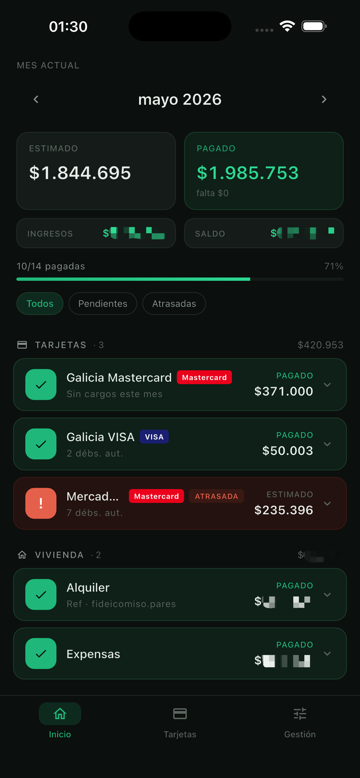
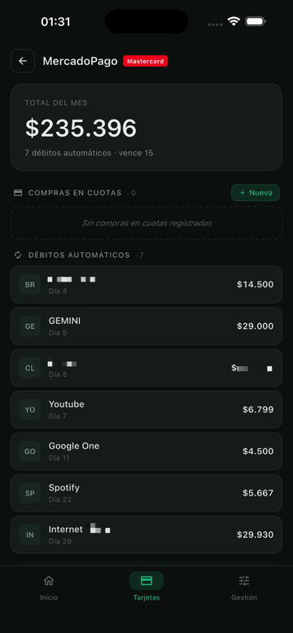
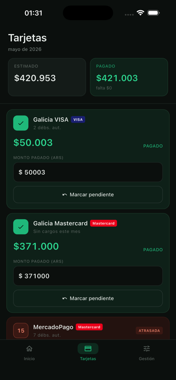
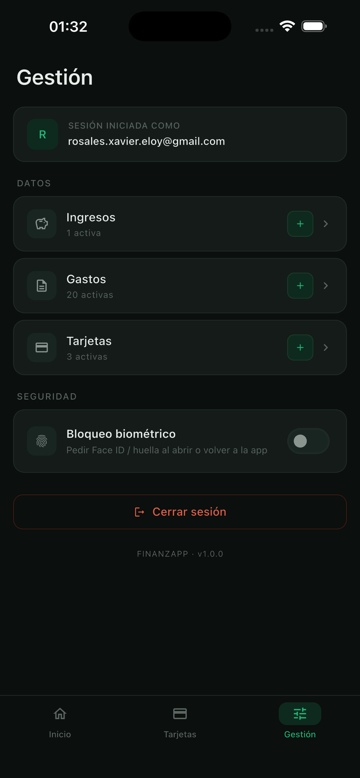

# Finanzapp

Control de gastos recurrentes obligatorios — versión nativa de FinanzasXavier.

Llevá el control de todo lo que pagás cada mes: servicios, suscripciones, cuotas y tarjetas de crédito. Mirá cuánto te falta pagar antes de fin de mes, marcá pagos en un toque y recibí recordatorios antes de cada vencimiento.

## Capturas

| Mes actual | Resumen | Tarjetas | Gestión |
|:---:|:---:|:---:|:---:|
|  |  |  |  |

## Características

- **Mes actual**: cuentas fijas con monto, vencimiento y estado (pagado / pendiente / atrasado); total estimado vs pagado en tiempo real.
- **Tarjetas de crédito**: cierre y vencimiento, cuotas activas y resumen mensual estimado.
- **Notificaciones**: recordatorios el día anterior al vencimiento, solo si las activás.
- **Bloqueo biométrico** opcional (Face ID / Touch ID / huella).
- **Login** con Magic Link (sin contraseña) o Google Sign-In.

## Stack

Flutter · Supabase (backend + auth con Row Level Security) · Firebase (Crashlytics).

## Getting Started

```bash
flutter pub get
flutter run
```

Para release, ver la configuración de signing en `android/key.properties` (gitignoreado) y `docs/play_store_listing.md` para los textos de la ficha.
